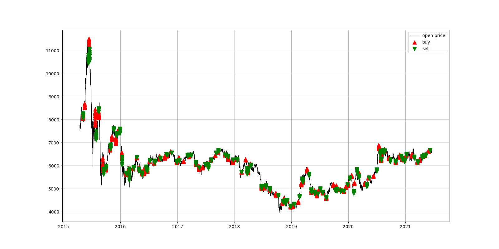

# Assignment 1
## Brief Introduction
This is the repository for assignment 1, which follows the work of a research paper by ***GF securities***. More information about this research paper can be found at 'research_paper' folder.

## What is Included
There are 3 folders in this repository
- i. 'codes' folder contains all of our code implementations, they are:
  - 'data_handle.py' which helps to read in data and process data.
  - 'stop_loss.py' which contains how to realize stop loss in this strategy.
  - 'GFTDV2.py' which calculates the factor ***GFTDV2***, generates the trading signal and mark the signals in pictures which can be found in the 'data\result_data' folder. 
  - 'main.py' , run this file and you can get the trading signal of our strategy.
- ii. 'research_paper' contains the pdf file of this paper.
- iii. 'data' folder contains:
  - input data: market data of CSI 500 index future (IC)
  - 'result_data' folder: contains the csv files which stores the trading signal of this strategy, as well as the pictures of it (see as follows).

